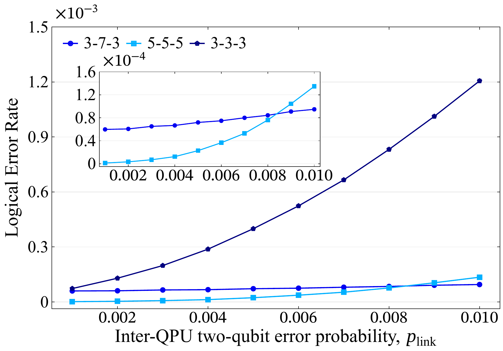
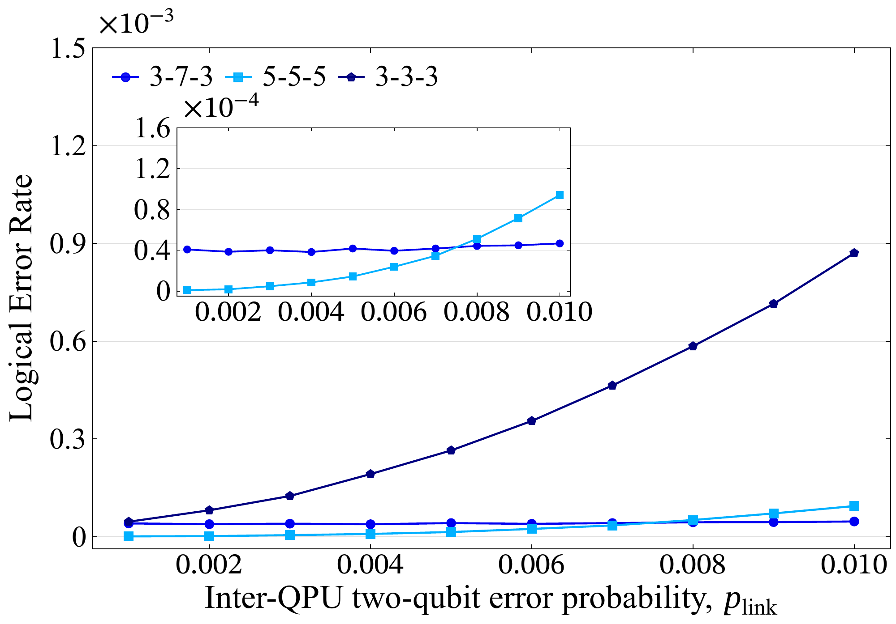
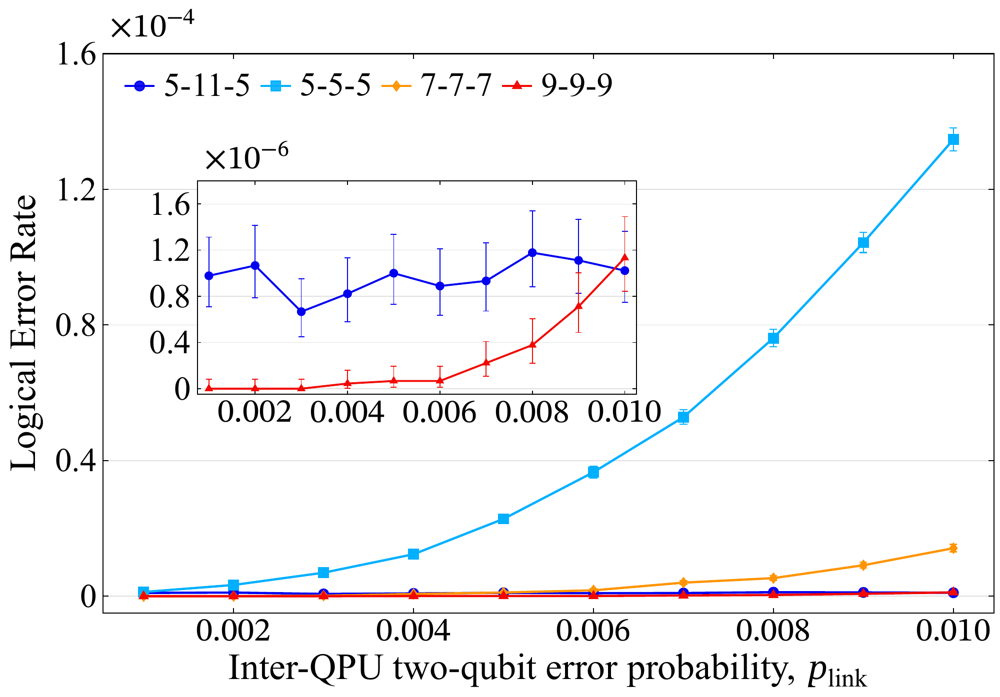
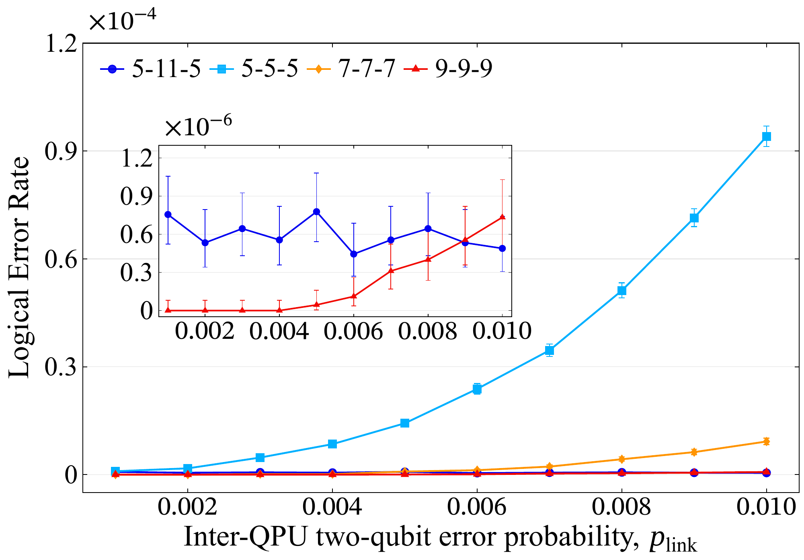

# 8DAM

Circuits, simulation data, and figures accompanying the paper. The plots show logical error rate (LER) against the inter-QPU two-qubit error probability, `p_link`.

## Figures

| Comparison | Configurations | Logical X | Logical Z |
| --- | --- | --- | --- |
| Small footprint | `3-7-3`, `5-5-5`, `3-3-3` | [](single_lcnot/figures/small_footprint_logical_x_LER.pdf)<br>[PDF](single_lcnot/figures/small_footprint_logical_x_LER.pdf) | [](single_lcnot/figures/small_footprint_logical_z_LER.pdf)<br>[PDF](single_lcnot/figures/small_footprint_logical_z_LER.pdf) |
| Large footprint | `5-11-5`, `5-5-5`, `7-7-7`, `9-9-9` | [](single_lcnot/figures/large_footprint_logical_x_LER.pdf)<br>[PDF](single_lcnot/figures/large_footprint_logical_x_LER.pdf) | [](single_lcnot/figures/large_footprint_logical_z_LER.pdf)<br>[PDF](single_lcnot/figures/large_footprint_logical_z_LER.pdf) |

[Single-LCNOT figure files](single_lcnot/figures/readme.md) · [Dual-LCNOT figure and data](dual_lcnot/figures/readme.md)

## Browse by configuration

| Configuration | Comparisons |
| --- | --- |
| [3-3-3](single_lcnot/3-3-3/readme.md) | Small footprint |
| [3-7-3](single_lcnot/3-7-3/readme.md) | Small footprint |
| [5-5-5](single_lcnot/5-5-5/readme.md) | Small and large footprints |
| [5-11-5](single_lcnot/5-11-5/readme.md) | Large footprint |
| [7-7-7](single_lcnot/7-7-7/readme.md) | Large footprint |
| [9-9-9](single_lcnot/9-9-9/readme.md) | Large footprint |

## Circuits, data, and scripts

Each configuration contains circuits, results CSVs, noisy simulation inputs, and visualizations. The `control_x_` and `target_z_` filename prefixes identify the readout experiment. Each readout uses 45 million shots per link-error rate.

- [Browse the circuit archive](index.html).
- [View Stim detector-slice diagrams](docs/DETECTOR_SLICES.md).
- [Reproduce and verify the simulations](docs/METHODS.md).
- [Read the results-table definitions](docs/DATA_DICTIONARY.md).
- [Rebuild the paper figures](docs/FIGURES.md).
- [Browse the dual LCNOT target-Z simulation and reference](dual_lcnot/readme.md).
- [Noise and decoding settings](docs/SCIENTIFIC_LIMITATIONS.md).

## Run and verify

Use Python 3.10 or 3.11 and the pinned dependencies:

```sh
python3 -m venv .venv
.venv/bin/python -m pip install -r requirements.txt
.venv/bin/python scripts/verify_release.py
```

Check all decoder models without drawing new samples:

```sh
.venv/bin/python scripts/verify_release.py --models
```

Check one readout experiment, then optionally run a small new simulation:

```sh
.venv/bin/python scripts/run_simulation.py single_lcnot/3-7-3/control_x.stim --p-link 0.01 --check-only
.venv/bin/python scripts/run_simulation.py single_lcnot/3-7-3/control_x.stim --p-link 0.01 --shots 10000
```

New simulation results are saved in `new_runs/`. Change the circuit path and `--p-link` to select another experiment; `--shots` sets the number of new samples.

## Circuit visualizations

Each circuit folder includes one detector-slice SVG showing all ticks and instructions for importing its circuit into [Crumble](https://algassert.com/crumble). In a downloaded repository, open the corresponding `*_crumble.html` file to launch Crumble automatically.

## License

See [licensing information](LICENSE_NOTICE.md).
