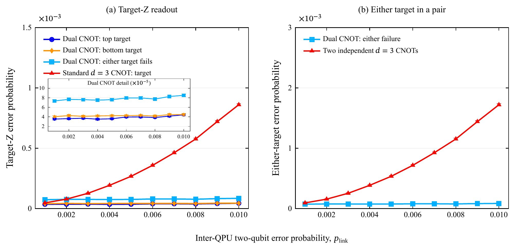

# Dual-LCNOT figures

Select the image to open its PDF. TeX source, data, and shot counts are linked below.

## Target-Z readout and either-target failure comparison

[Download PDF](publication_ler_standard_linear_inset_45m.pdf) | [TeX source](publication_ler_standard_linear_inset_45m.tex) | [Comparison data](comparison_data.csv) | [Shot counts](counts_45m.csv)

Each point uses 45 million shots and 95% Wilson intervals. The independent-pair reference is calculated from the single-CNOT probability; see the [data dictionary](../../docs/DATA_DICTIONARY.md).

See [figure reproduction](../../docs/FIGURES.md), [methods](../../docs/METHODS.md), and [noise and decoding](../../docs/SCIENTIFIC_LIMITATIONS.md) for rebuild instructions and simulation settings.

[Dual-LCNOT overview](../readme.md) | [Repository overview](../../README.md)
